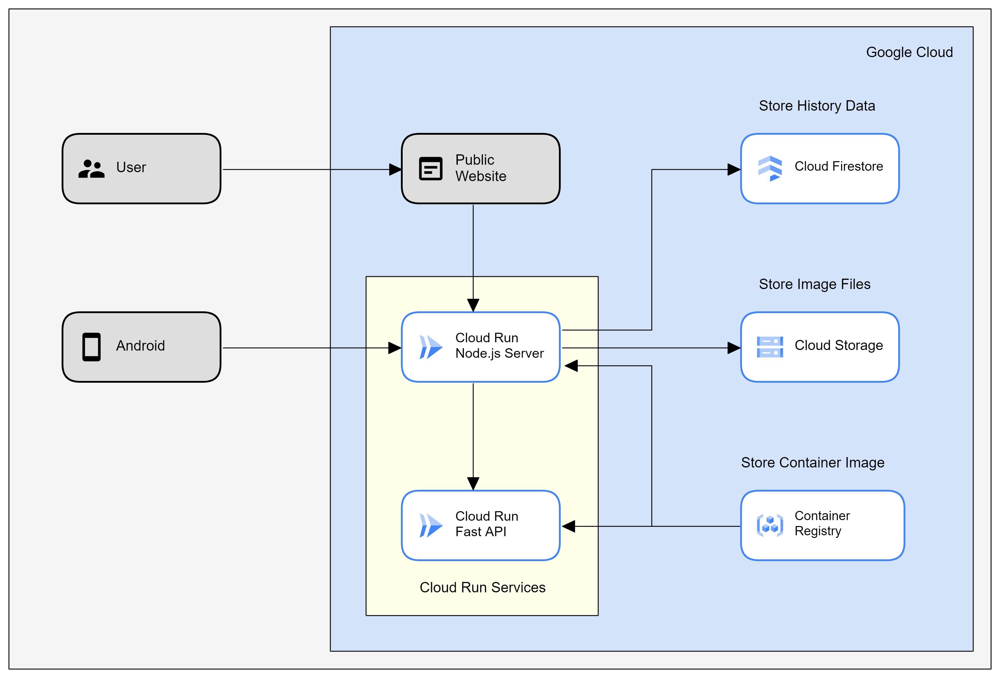

# Deploying to GCP

Here are the steps to manually deploy our back-end to Google Cloud Platform. Every command is run in Cloud Shell unless specified otherwise.

GCP services used:

- Cloud Run
- Container Registry
- Cloud Storage
- Firestore

## GCP architecture



## Set environment variables and enable services

```bash
export PROJECT_ID=$(gcloud config get-value project)
export PROJECT_NUMBER=$(gcloud projects describe $PROJECT_ID --format='value(projectNumber)')
export REGION=asia-southeast2

gcloud services enable \
    run.googleapis.com \
    containerregistry.googleapis.com \
    storage.googleapis.com \
    firestore.googleapis.com \
    file.googleapis.com
```

## GCS setup

1. Make bucket.

   ```bash
   gsutil mb -p capstone-sortify -c standard -l asia-southeast2 -b on gs://sortify-app
   ```


## Firestore setup

1. Create firestore database

```bash
    gcloud firestore databases create --location=$REGION
```

## Cloud Run setup

This part is mostly manual because we didn't configure a CI/CD pipeline.

### FastAPI

1.  Clone project repo from GitHub.

    ```bash
    git clone https://github.com/Sortify-Capstone/Sortify.git
    
    cd Sortify/'Cloud Computing'/fastapi-serving
    ```

2.  Build and push Docker image.

    ```bash
    docker build -t gcr.io/$PROJECT_ID/sortify-model:v1 .
    docker push gcr.io/$PROJECT_ID/sortify-model:v1

    ```

3.  Deploy to Cloud Run.

```bash
    gcloud run deploy sortify-model \
    --image gcr.io/$PROJECT_ID/sortify-model:v1 \
    --platform managed \
    --allow-unauthenticated \
    --region=$REGION \
    --cpu=1 \
    --min-instances=1 \
    --max-instances=4 \
    --port=8080 \
    --memory=1G
```

4.  Show Cloud Run service URL, copy and save for later use.

    ```bash
    gcloud run services describe sortify-model --platform managed --region $REGION --format 'value(status.url)'
    ```

### Node.js web server

1. Clone project repo from GitHub.

   ```bash
   git clone https://github.com/Sortify-Capstone/Sortify.git

   cd Sortify/'Cloud Computing'/sortify-api
   ```

2. Build and push Docker image.

   ```bash
   docker build -t gcr.io/$PROJECT_ID/sortify-api:v1 .
   docker push gcr.io/$PROJECT_ID/sortify-api:v1

   ```

3. Deploy to Cloud Run.

   ```bash
   gcloud run deploy sortify-api \
   --image gcr.io/$PROJECT_ID/sortify-api:v1 \
   --platform managed \
   --allow-unauthenticated \
   --region=$REGION \
   --cpu=1 \
   --min-instances=1 \
   --max-instances=4 \
   --port=8080

   ```

4. Show Cloud Run service URL.
    Show Cloud Run service URL, copy and save for later use.
   ```bash
   gcloud run services describe sortify-api --platform managed --region $REGION --format 'value(status.url)'
   ```
